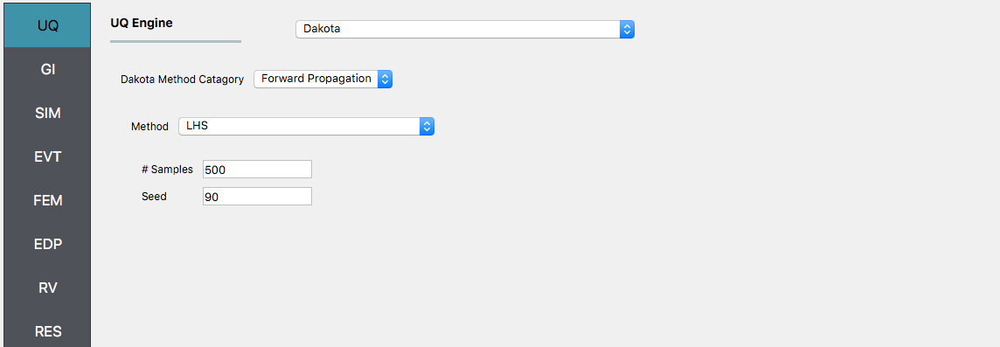
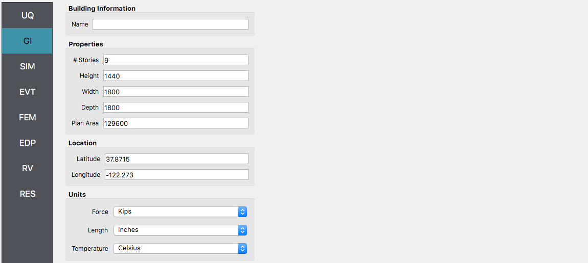
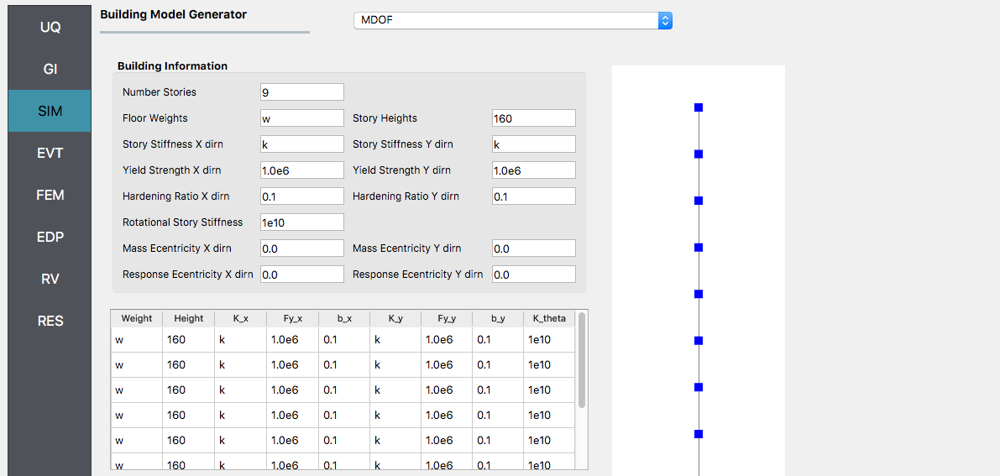
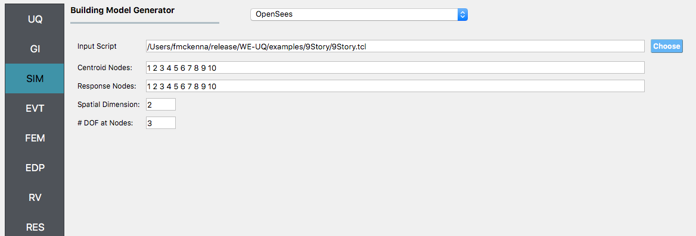
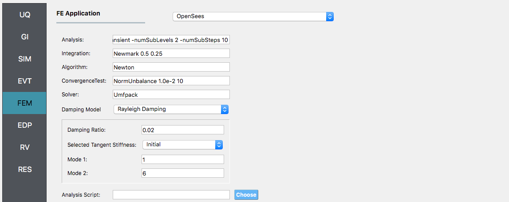
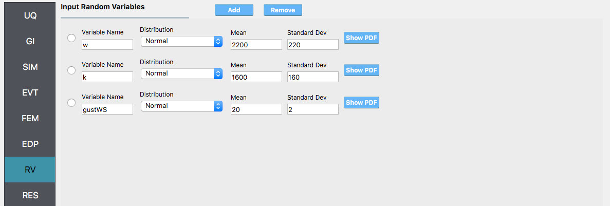
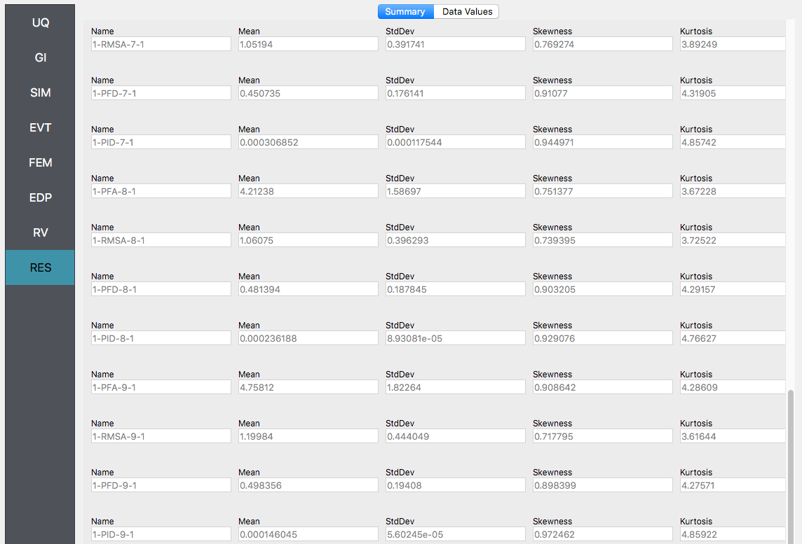
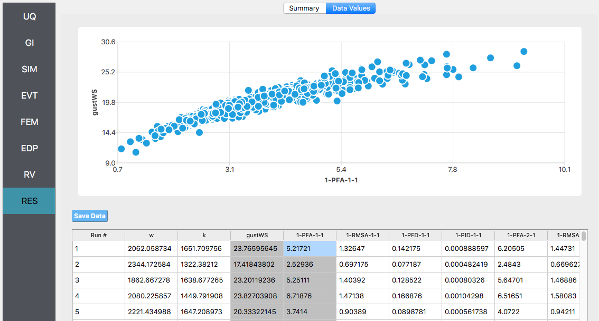

9 Story Building: Sampling Analysis {#lblWE-Example9}
===================================

Consider the problem of uncertainty quantification in a nine story steel
building. The building being modelled is the 9 story LA building
presented in the FEMA-355C report. From the description in Appendix B of
the FEMA document the building is a **150** ft square building with a
height above ground of **120** ft with a weight of approx. **19,800**
kips. Eigenvalues are shown in Table 5.1. of the FEMA document to be
between **2.3** sec and **2.2** sec depending on connection detals. For
this example (and for demonstrative purposes only), this building will
be modelled as a shear building with **10** nodes and **9** elements, as
shown in following figure. For loading, the Stochastic Wind Generation
tool will be used with the gust wind speed being treated as a random
variable with a normal distribtion described by a mean
$\mu_{gustWS}=20 \mathrm{mph}$ and standard deviation
$\sigma_{gustWS} =3 \mathrm{mph}$.

{.align-centeralign-center width="600px"}

The structure has uncertain properties that all follow normal
distribution:

1.  Weight of Typical Floor(`w`): mean $\mu_w=2200 \mathrm{kip}$ and
    standard deviation $\sigma_w =200 \mathrm{kip}$ (COV = 10%)
2.  Story Stiffness(`k`): mean $\mu_k=1600 \mathrm{kip/in}$ and standard
    deviation $\sigma_k =160 \mathrm{kip/in}$ (COV = 10%)

::: {.note}
::: {.title}
Note
:::

1.  For the mean values provided the natural period of the structure is
    **2.27** sec.
2.  The choice of COV percentages is for demonstrative purposes only.
3.  The exercise will use both the MDOF, `lblMDOF`{.interpreted-text
    role="numref"}, and OpenSees, `lblOpenSeesSIM`{.interpreted-text
    role="numref"}, structural generators. For the OpenSees generator
    the following model script, :weuq-01:[Frame9Model.tcl
    \<src/Frame9Model.tcl\>]{.title-ref}.

::: {.literalinclude language="tcl"}
src/Frame9Model.tcl
:::

1.  The first lines containing `pset` will be read by the application
    when the file is selected and the application will auto-populate the
    random variables `w` and `k` in the **RV** panel with this same
    variable name. It is of course possible to explicitly use random
    variables without the `pset` command by \"RV.\*\*variable name\" in
    the input file. However, no random variables will be auto-populated
    if user chooses this route.
:::

::: {.warning}
::: {.title}
Warning
:::

Do not place the file in your root, downloads, or desktop folder as when
the application runs it will copy the contents on the directories and
subdirectories containing this file multiple times (a copy will be made
for each sample specified). If you are like us, your root, Downloads or
Documents folders contains and awful lot of files and when the backend
workflow runs you will slowly find you will run out of disk space!
:::

Sampling Analysis
-----------------

  ---------------- --------------------------
  Problem files    :weuq-01:[/]{.title-ref}

  ---------------- --------------------------

To perform a Sampling or Forward propagation uncertainty analysis the
user would perform the following steps:

1.  Start the application and the UQ Selection will be highlighted. In
    the panel for the UQ selection, keep the UQ engine as that selected,
    i.e. Dakota, and the UQ Method Category as Forward Propagation, and
    the Forward Propagation method as LHS (Latin Hypercube). Change the
    \#samples to 500 and the seed to 20 as shown in the figure.

{.align-centeralign-center}

2.  Next select the **GI** panel. In this panel the building properties
    and units are set. For this example enter **9** for the number of
    stories, **1400** for building height, and **1600** for building
    breadth and depth

{.align-centeralign-center}

3.  Next select the **SIM** panel from the input panel. This will
    default in the MDOF model generator. We will use this generator (the
    NOTE below contains instruction on how to use the OpenSees scipt
    instead). In the building information panel, the number of stories
    should show **9** and the story heights **160**. In the building
    Information box specify **w** for the floor weights and **k** for
    story stiffness (in both x and y directions).

{.align-centeralign-center}

::: {.note}
::: {.title}
Note
:::

To specify instead to use the OpenSees script instead, from thee Model
Generator pull down menu select `OpenSees`. For the fields in the panel
presented enter the path to the :weuq-01:[Frame9Model.tcl
\<src/Frame9Model.tcl\>]{.title-ref} script. For both the Centroid Nodes
(those nodes were the floor loads will be applied) the Response Nodes
(those nodes from which the reponse quantities will be evaluated) as **1
2 3 4 5 6 7 8 9 10** in the panel. The Response nodes will tell model
generator which nodes correspond to nodes at the 4 floor levels for
which responses are to be obtained when using the standard earthquake
EDP\'s.

{.align-centeralign-center}
:::

3.  Next select the **EVT** panel. From the Load Generator pull down
    menu select the **Stochastic Wind** option. Leave the exposure
    condition as **B**. Set the drag coefficient as **1.3** and enter
    `gustWS` for the 3 sec gust wind speed at the 33 ft height.

{.align-centeralign-center}

3.  Next choose the **FEM** panel. Here we will change the entries to
    use Rayleigh damping, with rayleigh factor chosen using **1** and
    **6** modes. For the **MDOF** model generator, because it generates
    a model with two translational and 1 rotational degree-of-freedom in
    each direction and because we have provided the same **k** values in
    each translational direction, i.e. we will have duplicate
    eigenvalues, we specify as shown in the figure modes **1** and
    **6**.

{.align-centeralign-center}

4.  We will skip the **EDP** panel leaving it in it\'s default
    condition, that being to use the **Standard Wind** EDP generator.
5.  For the **RV** panel, we will enter the distributions and values for
    our random variables. Because of the steps we have followed and
    entries we have made, the panel when we open it should contain the
    **3** random variables and they should all be set constant. For the
    w, k and wS random variables we change the distributions to normal
    and enter the values given for the problem, as shown in figure
    below.

{.align-centeralign-center}

::: {.warning}
::: {.title}
Warning
:::

The user cannot leave any of the distributions for these values as
constant for the Dakota UQ engine.
:::

5.  Next click on the **Run** button. This will cause the backend
    application to launch dakota. When done the **RES** panel will be
    selected and the results will be displayed. The results show the
    values the mean and standard deviation. The peak displacement of the
    roof, is the quantity **1-PFD-9-1** (first event (tool to be
    extended to multiple events), 9th floor (in US ground floor
    considered 0), and 1 dof direction). the **PFA** quantity defines
    peak floor acceleration, the **RMSA** quantity the root mean square
    of floor accelerations, and the **PID** quantity corresponds to peak
    interstory drift.

{.align-centeralign-center}

If the user selects the \"Data\" tab in the results panel, they will be
presented with both a graphical plot and a tabular listing of the data.
By left- and right-clicking with the mouse in the individual columns the
axis change (left mouse click controls vertical axis, right mouse click
the horizontal axis).

{.align-centeralign-center}

Various views of the graphical display can be obtained by left and right
clicking in the columns of the tabular data. If a singular column of the
tabular data is pressed with both right and left buttons a frequency and
CDF will be displayed, as shown in figure below.

{.align-centeralign-center}
